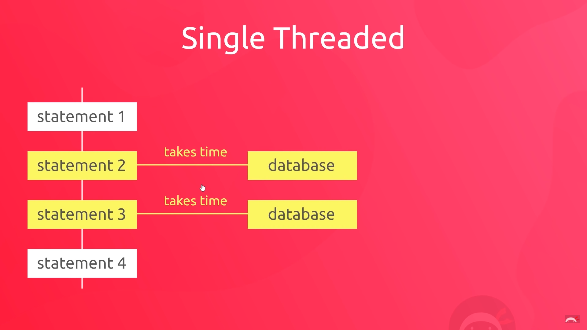
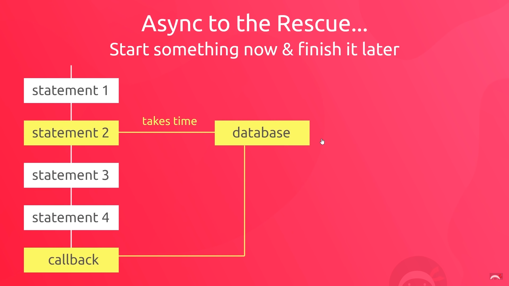

# Async JavaScript

## Sync Code Execution



## Async Code Execution



---

> setTimeout: we're passing a function and that function fires after a certain amount of time that we specify.

Example Code:

```js
setTimeout(() => {
  console.log("callback function fired");
}, 2000); // 2 saniye sonra fonksiyon çalıştırılacak
```

This function is `asynchronous.`

JavaScript Code:

```js
console.log(1);
console.log(2);

setTimeout(() => {
  console.log("callback function fired");
}, 2000);

console.log(3);
console.log(4);
```

Output:

```
1
2
3
4
callback function fired
```

---

## HTTP Requests

```js
const request = new XMLHttpRequest(); // this creates us a request object

request.addEventListener('readystatechange', function() { // this fires every time there's a state change
    //console.log(request, request.readyState);
    if (request.readyState === 4) {
        console.log(request.responseText);
    }
}); 

request.open('GET', 'https://jsonplaceholder.typicode.com/todos/')
request.send()
```

| Value | State            | Description                                                   |
| ----- | ---------------- | ------------------------------------------------------------- |
| 0     | UNSENT           | Client has been created. open() not called yet.               |
| 1     | OPENED           | open() has been called.                                       |
| 2     | HEADERS_RECEIVED | send() has been called, and headers and status are available. |
| 3     | LOADING          | Downloading; responseText holds partial data.                 |
| 4     | DONE             | The operation is complete.                                    |

Reference: https://developer.mozilla.org/en-US/docs/Web/API/XMLHttpRequest/readyState

---

## Video 3

```js
const request = new XMLHttpRequest(); // this creates us a request object

request.addEventListener('readystatechange', function () { // this fires every time there's a state change
    //console.log(request, request.readyState);
    if (request.readyState === 4 && request.status === 200) {
        console.log(request, request.responseText);
    } else if (request.readyState === 4) {
        console.log('could not fetch the data');
    }
});

request.open('GET', 'https://jsonplaceholder.typicode.com/todoss/')
request.send()
```

## Video 4

```js
const getTodos = (callback) => {
    const request = new XMLHttpRequest(); // this creates us a request object

    request.addEventListener('readystatechange', function () { // this fires every time there's a state change
        //console.log(request, request.readyState);
        if (request.readyState === 4 && request.status === 200) {
            callback(undefined, request.responseText);
        } else if (request.readyState === 4) {
            callback('could not fetch', undefined);
        }
    });

    request.open('GET', 'https://jsonplaceholder.typicode.com/todos/')
    request.send()
};

console.log(1);
console.log(2);

getTodos((err, data) => { // convention: error first, data second
    console.log('callback fired');
    if (err) {
        console.log(err);
    }
    else {
        console.log(data);
    }
});

console.log(3);
console.log(4);
```

## Video 5

```js
const getTodos = (callback) => {
    const request = new XMLHttpRequest(); // this creates us a request object

    request.addEventListener('readystatechange', function () { // this fires every time there's a state change
        //console.log(request, request.readyState);
        if (request.readyState === 4 && request.status === 200) {
            const data = JSON.parse(request.responseText);
            callback(undefined, data);
        } else if (request.readyState === 4) {
            callback('could not fetch', undefined);
        }
    });

    // request.open('GET', 'https://jsonplaceholder.typicode.com/todos/')
    request.open('GET', 'todos.json')
    request.send()
};

console.log(1);
console.log(2);

getTodos((err, data) => { // convention: error first, data second
    console.log('callback fired');
    if (err) {
        console.log(err);
    }
    else {
        console.log(data);
    }
});

console.log(3);
console.log(4);
```

## Video 6
```js
const getTodos = (resource, callback) => {
    const request = new XMLHttpRequest(); // this creates us a request object

    request.addEventListener('readystatechange', function () { // this fires every time there's a state change
        //console.log(request, request.readyState);
        if (request.readyState === 4 && request.status === 200) {
            const data = JSON.parse(request.responseText);
            callback(undefined, data);
        } else if (request.readyState === 4) {
            callback('could not fetch', undefined);
        }
    });

    // request.open('GET', 'https://jsonplaceholder.typicode.com/todos/')
    request.open('GET', resource)
    request.send()
};

// This is called Callback Hell
getTodos('todos/luigi.json', (err, data) => { // convention: error first, data second
    console.log(data);
    getTodos('todos/mario.json', (err, data) => {
        console.log(data);
        getTodos('todos/shaun.json', (err, data) => {
            console.log(data);
        });
    });
});
```